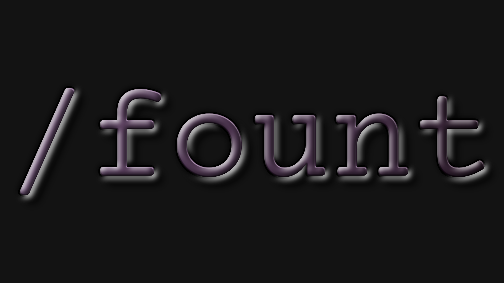
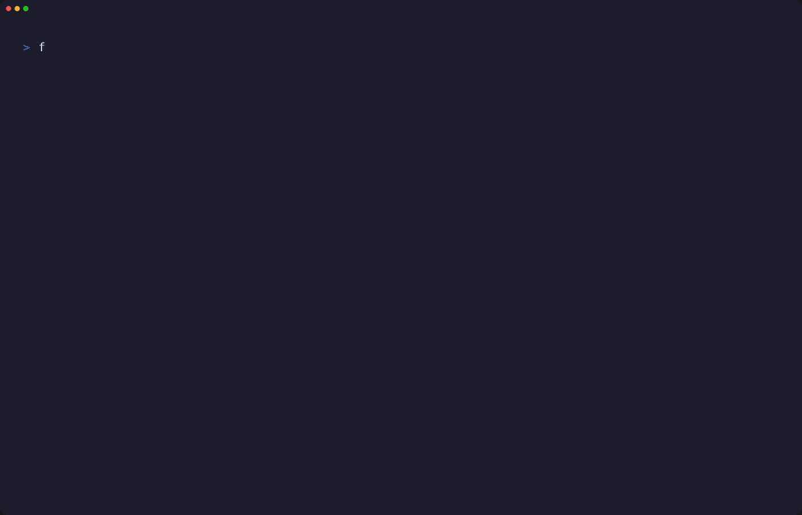
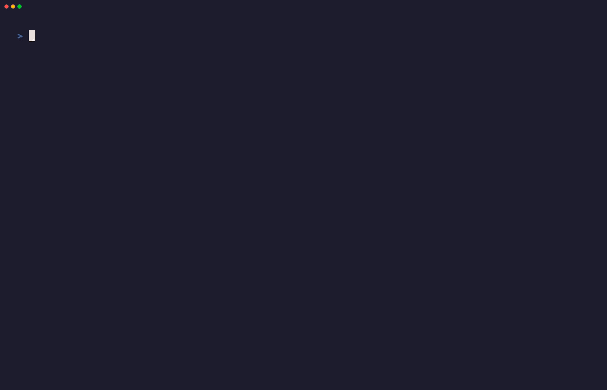
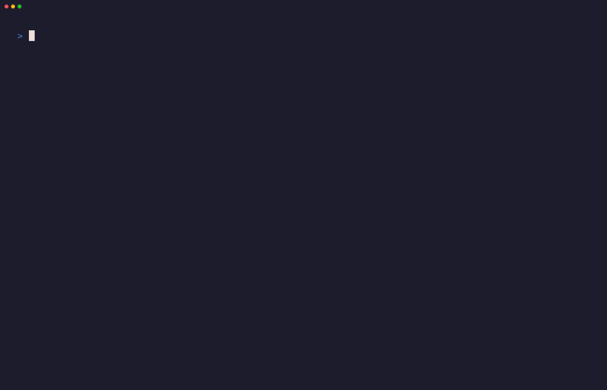

<p align="center">
  
</p>

# Fount
**Fount** is a minimal, distraction-free Fountain screenplay editor built for writers who live in the terminal. It blends the raw efficiency of Rust with a "Zen Studio" aesthetic, providing a writing experience that feels professional, focused, and deeply personal.

---

## 🚀 Installation

### Linux
- **Arch Linux (AUR)**:
  ```bash
  yay -S fount-bin
  ```
- **Debian / Ubuntu**: Download the latest `.deb` package from the [Releases](https://github.com/BeetleBot/FountTUI/releases) page.
- **Fedora / RHEL**: Download the latest `.rpm` package from the [Releases](https://github.com/BeetleBot/FountTUI/releases) page.

### Any Platform (via Cargo)
```bash
cargo install fount
```

### Windows
- **MSI Installer (Primary Method for Casual Users)**:
  Download the latest `.msi` package from the [Releases](https://github.com/BeetleBot/FountTUI/releases) page.
  > [!IMPORTANT]
  > **Windows SmartScreen** will block the installation because the executable is not digitally signed. You **must** turn off SmartScreen completely in Windows Security settings before running the installer.

- **Cargo (For Advanced Users)**: `cargo install fount` (requires [Rust](https://rustup.rs/))
  > [!TIP]
  > Cargo provides a seamless, source-based installation that ensures you stay on the bleeding edge of Fount's development with immediate access to the latest features and performance improvements.

- **Winget**:
  ```powershell
  winget install BeetleBot.Fount
  ```
  > [!NOTE]
  > Winget versions usually receive updates later than the official releases.

### macOS
- **Cargo**: `cargo install fount` (for best results, use a terminal with Truecolor support like iTerm2 or Ghostty)

---

## ✍️ Developer's Note

> [!NOTE]
> **A Letter from the Creator**
> 
> As a credited Tamil/Indian screenwriter—writing predominantly in **English and Tanglish**—I found myself at a crossroads when I transitioned to Linux. I deeply missed **[Beat](https://github.com/lmparppei/Beat)**, my long-time companion for storytelling, and couldn't find a minimalist alternative that felt "right" in the terminal.
> 
> My search led me to **[Lottie](https://github.com/coignard/lottie)**, whose elegance immediately captivated me. I cloned the project and began shaping it into the tool I needed. While I possess a moderate grasp of Rust, this journey was significantly smoothed by the partnership of **AI Agents like Claude and Gemini**. 
> 
> AI was instrumental in helping me overcome technical hurdles, complicated logic, and the often frustrating nuances of software release workflows. Fount is the result of my creative vision and little bit of coding background, the open-source code that inspired me, and the intelligence of the agents that helped me build it. It is a tool I use daily, and I hope it serves you just as well.

---

## ✨ Feature Showcase

Fount is a dedicated writing environment designed to disappear while you work.

### 🎨 15+ Built-in Themes
Cycle through curated themes like **Catppuccin**, **Nord**, **Everforest**, and the new **Lilac** to suit your mood.


---

### 🗺️ Story-Map Navigation
Toggle the **Scene Navigator (`Ctrl+H`)** or **Character Sidebar (`Ctrl+L`)** to jump through your screenplay's structure or analyze character presence.


---

### 📊 X-Ray Analysis
Visualize your screenplay's pacing, character frequency, and scene length distribution in real-time using **X-Ray** (`/xray`) mode


---

### 🃏 Story Architect (Index Cards)
Plot your story at a high level using the grid-based **Index Cards (`/ic`)** mode.


---

### ⏱️ Writing Sprints
Stay productive with built-in **Writing Sprints (`/sprint`)** and track your session history.


---

### 🔍 Search & Replace
A powerful find-and-replace workflow with interactive highlighting.


---

## 🏛️ Inspiration & Credits

Fount stands on the shoulders of giants. This project would not have been possible without the inspiration and foundational work of the following:

1.  **[Lottie](https://github.com/coignard/lottie)**: My immediate inspiration. Fount began as a fork and evolution of this beautiful terminal editor.
2.  **[Beat](https://github.com/lmparppei/Beat)**: The gold standard for minimalist screenwriting software. Fount is my attempt to bring the spirit of Beat to the Linux terminal.
3.  **[Fountain.io](https://github.com/nyousefi/Fountain)**: The universal screenplay format that powers modern independent screenwriting.

> [!IMPORTANT]
> A massive thank you to the creators of these tools. Their commitment to the craft of writing and software design continues to inspire creators worldwide.
